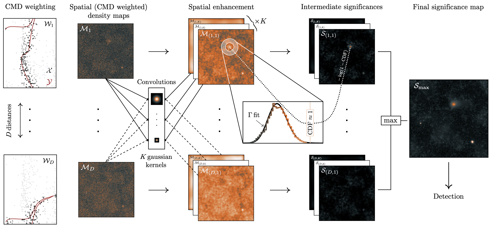

<div align="center">
  <picture>
    <source
    srcset="./logos/DarkkMode.png"
    media="(prefers-color-scheme: dark)"
    width="100%" height="100%"
    />
    
  </picture>
    
  <h3 align="center">Enhancing Rapidly Overdensities of Sources with Ease</h3>
</div>

[](https://pypi.python.org/pypi/erose)

## Overview

`erose` is a Python package that automatically searches for dwarf galaxies in stellar catalogues. It requires minimal inputs and can process surveys such as DES on a current laptop in less than a day.

## Installation

You can install `erose` from PyPI: 
```bash
pip install erose
```
All required dependencies will be installed automatically.



